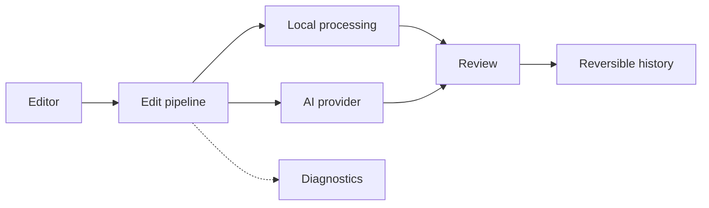

# Mirai — Reversible AI Image Editor

A local-first AI image editor with selection-aware generation, semantic-fidelity validation, reversible history, and reproducible diagnostics.

[](https://github.com/nothing331/mirai-image-editor/actions/workflows/ci.yml)

Edit an image, compare the result, accept or discard it, and undo any accepted change.

<!-- Add a hero image or short Upload → Select → Generate → Compare → Accept GIF here. -->

## Features

- **AI editing** — Remove, replace, restyle, transform, and extend images.
- **Precise control** — Use selections as flexible focus hints or protected edit boundaries.
- **Safe review** — Compare generated results before accepting them.
- **Reversible history** — Undo and redo immutable image versions without changing the original.
- **Local projects** — Save projects, inspect request diagnostics, and export PNG or JPEG.

<!-- Add three examples here: selection-aware editing, before/after comparison, and history or diagnostics. -->

## Quick start

Mirai supports Node.js 24.19.0 and npm 11.17.0. With `nvm`, run `nvm install` and `nvm use` before installing dependencies.

```bash
git clone https://github.com/nothing331/mirai-image-editor.git
cd mirai-image-editor && npm ci
npm run dev
```

Open [http://localhost:3000](http://localhost:3000). No API key is required for the default demo workflow.

> [!WARNING]
> Mirai v0.1.0 is designed for trusted local use. It has no authentication or tenant isolation, and local diagnostics may contain images and prompts. Do not expose this version directly to the public internet.

## How it fits together



Built as a Next.js and TypeScript modular monolith, with provider integrations kept behind server-side interfaces.

## What I designed and implemented

- The canvas editing workflow and selection-aware AI experience
- A shared pipeline for deterministic and generative edits
- Immutable image versions with undo, redo, comparison, persistence, and export
- Provider-neutral generation, semantic checks, and reproducible request diagnostics

## Engineering decisions

Mirai preserves the original image, treats AI output as a reviewable proposal, and records every accepted edit as an immutable version.

See [PROJECT.md](./PROJECT.md) for the architecture, tradeoffs, and design decisions.

## Testing

Run the standard verification suite:

```bash
npm run lint
npm run typecheck
npm test
npm run build
```

These commands run ESLint, generate and check Next.js and TypeScript types, execute the unit and integration tests, and create a production build.

Install Playwright Chromium once, then run the browser workflow:

```bash
npx playwright install chromium
npm run test:e2e
```

Tests cover coordinate conversion, masks, protected pixels, edit acceptance, history, persistence, and export.

To run the browser suite on GitHub, open **Actions → Playwright E2E → Run workflow** and choose a branch. Each manual run uses the fake providers and retains its HTML report, failure screenshots, and traces for seven days.

## Using OpenAI

The deterministic fake provider is enabled by default. To test real generation, copy `.env.example` to `.env.local`, set `IMAGE_EDIT_PROVIDER=openai`, and add `OPENAI_API_KEY`. Credentials remain server-side and must not be committed.

## Troubleshooting

- **Unsupported Node.js version:** Run `nvm install` and `nvm use`, then confirm `node --version` reports `v24.19.0`.
- **`npm ci` reports a lockfile mismatch:** Confirm `npm --version` reports `11.17.0`. Regenerate the lockfile only when intentionally updating dependencies.
- **OpenAI key error:** Keep `IMAGE_EDIT_PROVIDER` and `ASSET_GENERATION_PROVIDER` set to `fake`, or configure a server-side key when intentionally testing OpenAI.
- **Port 3000 is already in use:** Start the development server with `npm run dev -- --port 3001`.

## Current limitations

- Local single-user application; no authentication or collaboration
- Linear history; no independent layers or history branches
- Real AI edits require an OpenAI API key and may incur usage costs
- Semantic checks reduce unintended changes but cannot guarantee perfect results

## Privacy

Local diagnostics may contain uploaded images, generated images, masks, and exact prompts. They are excluded from Git but should still be treated as sensitive.

When OpenAI is enabled, relevant images, masks, and prompts are sent to the configured provider.

## Documentation

- [Project architecture and decisions](./PROJECT.md)
- [Implemented feature behavior](./FEATURE_CONTEXT.md)
- [Frontend design system](./FRONTEND_DESIGN.md)
- [Development plan](./LOCAL_DEVELOPMENT_PLAN.md)
- [Contributing](./CONTRIBUTING.md)
- [Security policy](./SECURITY.md)

## License

Licensed under the [Apache License 2.0](./LICENSE).
